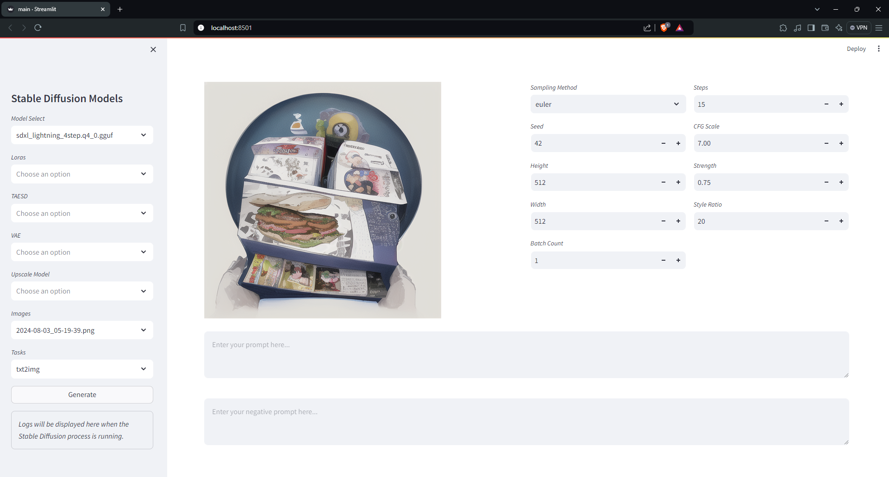

### stable-diffusion-cpp-web-ui

Streamlit-based web UI for running diffusion models with [stable-diffusion.cpp](https://github.com/leejet/stable-diffusion.cpp).

## Directory Structure

Store models as follows, and run the web UI from the root directory.

```
.
├── config.py
├── main.py
├── stable_diffusion_cpp.py
├── models
│   ├── checkpoints
│   ├── loras
│   ├── taesd
│   ├── vae
│   ├── upscale_models
├── assets
│   ├── main.png
├── images
│   ├── example.png
└── README.md

```

## Requirements

- Python 3.10
- [stable-diffusion.cpp](https://github.com/leejet/stable-diffusion.cpp)
- [streamlit](https://github.com/streamlit/streamlit)

## UI

